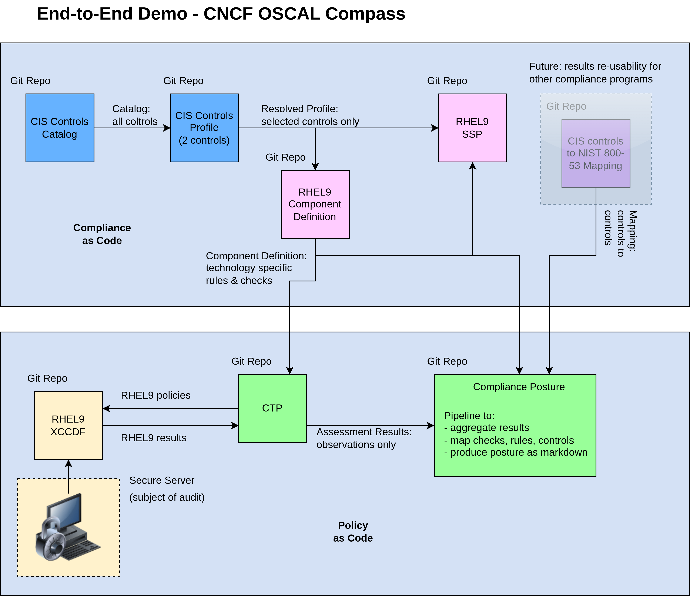

# End-to-end Demo - CNCF OSCAL Compass
End-to-end Demo - CNCF OSCAL Compass

#### Overview

This end-to-end demo shows use of CNCF OSCAL Compass compliance-trestle and agile-authoring for (continuous) compliance standardization and automation.

##### Catalog

[repo](https://github.com/oscal-compass/e2e-demo-cac-catalog-cis)

- Shown is CIS Catalog v8, which is already available in OSCAL format.
- This repo is used as the "source" for dependent repos needing this catalog.
- In some cases, the OSCAL format of the catalog is not available. In such circumstances, the Catalog repo can be used to do the transformation from the original source format into OSCAL using compliance-trestle tools.

##### Profile

[repo](https://github.com/oscal-compass/e2e-demo-cac-profile-cis)

- Shown is selected controls from CIS catalog.
- Use markdown editing to add guidance and assemble revised OSCAL profile.

##### Component Definition

[repo](https://github.com/oscal-compass/e2e-demo-cac-cd-cis-rhel9)

- Comprises 2 parts: 
    - RHEL9 software (from CIS Benchmarks) and 
    - OSCO validation (from Compliance as Code)
- trestle transformer is used to transform RHEL9 CIS Benchmark to OSCAL Component Definition

##### System Security Plan

[repo](https://github.com/oscal-compass/e2e-demo-cac-ssp-cis)

- Shown is selected SSP comprising RHEL9 component definition.
- Use markdown editing to add guidance and assemble revised OSCAL SSP.

##### Mapping

- Shown is *future* mapping model, for re-use of results from CISb to get posture for NIST 800-53.

-----
-----

##### C2P

Integration with C2P.

Reference: [compliance-to-policy-go](https://github.com/oscal-compass/compliance-to-policy-go)

