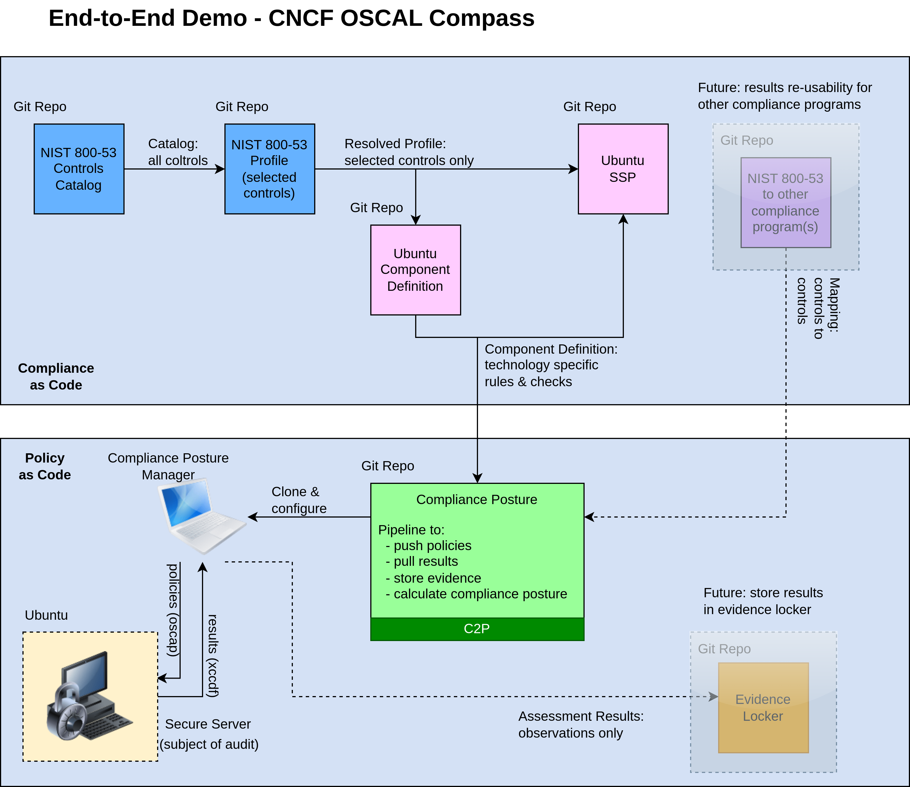
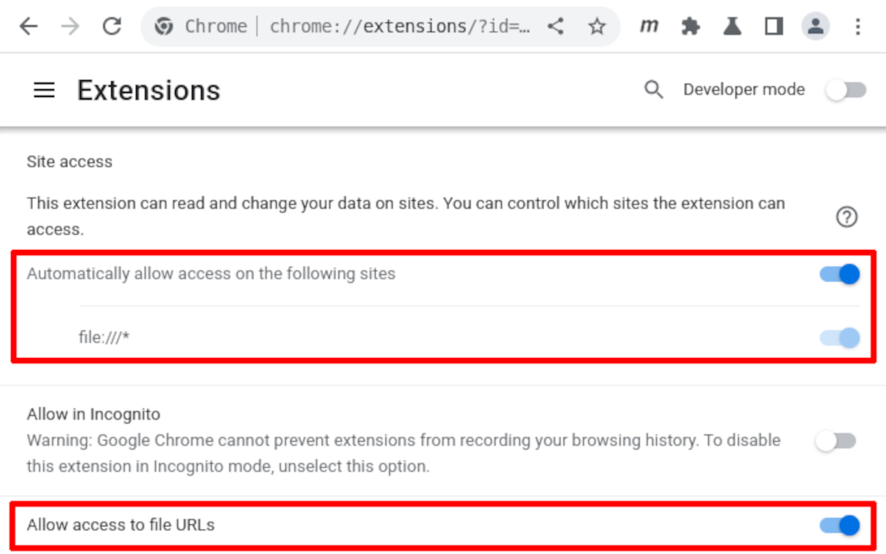
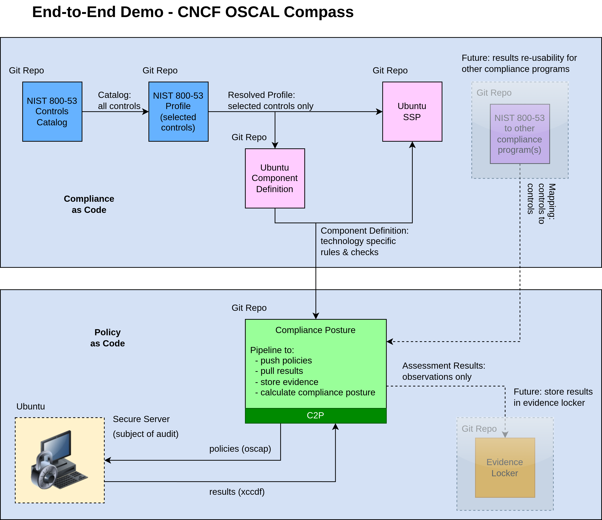

# End-to-end Demo - CNCF OSCAL Compass

#### Overview

This end-to-end demo shows use of CNCF OSCAL Compass compliance-trestle and agile-authoring for (continuous) compliance standardization and automation.



Reference: [compliance-to-policy-go](https://github.com/oscal-compass/compliance-to-policy-go)

##### Catalog

[repo](https://github.com/oscal-compass/e2e-demo-catalog)

- Shown is NIST 800-53, which is already available in [OSCAL format](https://github.com/usnistgov/oscal-content/tree/main/nist.gov/SP800-53/rev5/json).
- The present repo is used as the "source" for dependent repos needing this catalog.

Note: In some cases, the OSCAL format of a catalog is not available. In such circumstances, the Catalog repo itself can be used to do the transformation from the original source format into OSCAL using compliance-trestle and agile-authoring tools.

##### Profile

[repo](https://github.com/oscal-compass/e2e-demo-profile)

- Shown is selected controls from NIST 800-538 catalog.
- Use markdown editing to add guidance and assemble revised OSCAL profile.

##### Component Definition

[repo](https://github.com/oscal-compass/e2e-demo-cd)

- Comprises 2 parts: 
    - Ubuntu software component definition
    - OSCO validation component definition

##### System Security Plan

[repo](https://github.com/oscal-compass/e2e-demo-ssp)

- Shown is selected SSP comprising Ubuntu component definition.
- Use markdown editing to add guidance and assemble revised OSCAL SSP.

##### Mapping

[repo](https://github.com/oscal-compass/e2e-demo-mapping)

- Shown is *future* mapping model, for re-use of results from NIST 800-53 to get posture for other compliance program(s), such as HIPAA, GDPR, FedRAMP, SOC2...

##### Compliance posture

[repo](https://github.com/oscal-compass/e2e-demo-compliance-posture)

- Repo comprises compliance posture for Ubuntu system.

##### XCCDF Results for UBUNTU (e.g. evidence locker)

[repo](https://github.com/oscal-compass/e2e-demo-xccdf-ubuntu)

- Repo comprises XCCDF results for Ubuntu system.

-----
-----


## Demo

This demo shows how to use OSCAL Compass to compute the compliance posture for a subject VM.

###### Prerequisites

- Download and install VirtualBox from [https://www.virtualbox.org/wiki/Downloads](https://www.virtualbox.org/wiki/Downloads). This is the Oracle hypervisor that will run the VM.
- Download and install Vagrant from [https://developer.hashicorp.com/vagrant/install](https://developer.hashicorp.com/vagrant/install). Vagrant is a developers tool for automating the creation of lightweight, reproducible and portable virtual environments via command-line.

###### Fetch the compliance-posture repo and launch

```
> cd /tmp
> git clone https://github.com/oscal-compass/e2e-demo-compliance-posture.git
> cd e2e-demo-compliance-posture/
> make demo
```

The first time `make demo` is run, a Ubuntu VM is created and started. Then OSCAL Compass is used to:
- push the oscap profile to the VM 
- pull the oscap results from the VM
- convert the oscap results into OSCAL Assessment Results
- use the OSCAL Assessment Results calculate compliance posture

Subsequent invocations of `make demo` will utilize the already running VM.


```
> make clean-up
```

Run `make clean-up` when finished to shutdown the VM.

###### Notes

1. If the results don't pop up in a browser window, then manually open `file:///tmp/e2e-demo-compliance-posture/README.md` with your browser.

2. If the results don't preview in your Chrome browser, consider installing [Markdown Viewer Extension](https://chromewebstore.google.com/detail/markdown-viewer/ckkdlimhmcjmikdlpkmbgfkaikojcbjk). You may have to enable the extension to access files.

<details>
<summary>enable extension screen shot</summary>

</details>

-----
-----

##### Example configuration employing C2P (from Git repo)

<details>
<summary>Example 1</summary>

</details>

-----
-----

##### Example configuration employing Git repo as a substitute for the VM


<details>
<summary>Example 2</summary>

</details>
